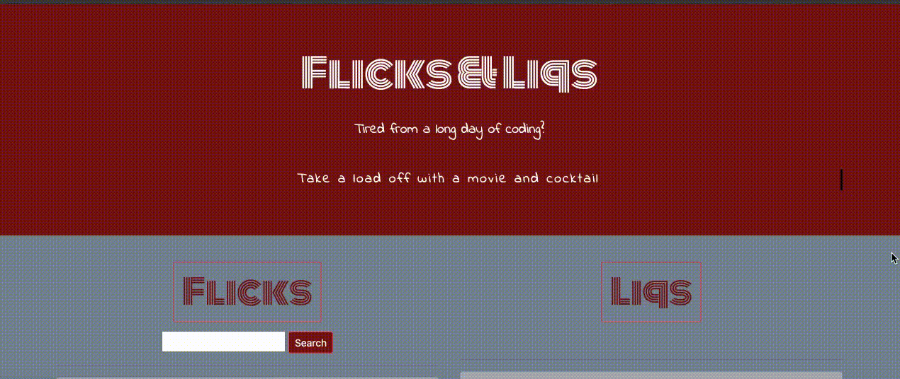

# Flicks&Liqs
Movie &amp; cocktail curator 

## Description
Movie and cocktail generator

## Motivation for development?
Coding can be stressful, created this app to promote mental wellness in bootcamp students 

## User story
After a long day of coding, wind down with a movie and cocktail. 
Cocktails are like a present you give to yourself

## Technologies used: 
HTML, CSS, Java Script, Bootstrap 

## Breakdown of tasks and roles
* 1 person per API fetch - created a card to host all data inputs
* 1 person in charge of index.html and consolidating HTML created in other pages
* Multiple people worked on CSS styling in different files

## Challenges
* Rejected from API requests- required business contract/payment
* Unable to load API when deployed- ensure the URL was set up as HTTPS
* Difficulty randomizing omdb API- resulted in creating JS file with list of movies that was randomized

## Successes
* 2 APIs selected were successful!
* Randomising buttons work!
* Search function works!
* Animation works!

## Links

* Git site: https://patelso9.github.io/FicksnLiqs/
* Git repo: https://github.com/Patelso9/FicksnLiqs
* Presentation: https://docs.google.com/presentation/d/1HXW7oBCrq1br-NXStCAYjDe1T-OCJey4MbC7dIVav_Q/edit?usp=sharing

## Images

## Project Requirements

You and your group will use everything you’ve learned over the past six units to create a real-world front-end application that you’ll be able to showcase to potential employers. The user story and acceptance criteria will depend on the project that you create, but your project must fulfil the following requirements:

* Use a CSS framework other than Bootstrap.

* Be deployed to GitHub Pages.

* Be interactive (i.e., accept and respond to user input).

* Use at least two [server-side APIs](https://coding-boot-camp.github.io/full-stack/apis/api-resources).

* Does not use alerts, confirms, or prompts (use modals).

* Use client-side storage to store persistent data.

* Be responsive.

* Have a polished UI.

* Have a clean repository that meets quality coding standards (file structure, naming conventions, follows best practices for class/id naming conventions, indentation, quality comments, etc.).

* Have a quality README (with unique name, description, technologies used, screenshot, and link to deployed application).

## Presentation Requirements

Use this [project presentation template](https://docs.google.com/presentation/d/10QaO9KH8HtUXj__81ve0SZcpO5DbMbqqQr4iPpbwKks/edit?usp=sharing) to address the following: 

* Elevator pitch: a one minute description of your application

* Concept: What is your user story? What was your motivation for development?

* Process: What were the technologies used? How were tasks and roles broken down and assigned? What challenges did you encounter? What were your successes?

* Demo: Show your stuff!

* Directions for Future Development

* Links to the deployed application and the GitHub repository

## Future Development

* Save liked movies and drinks to local storage
* Various search functions: alcohol type, movie genre, release year
* Create search criteria buttons/dropdowns: dropdowns to select: movie vs show, types of liquor/non-alc options, Language of movies
* Add searched movies to list of movie recommendations generated with the movie randomizer button
* Add landing page: “Are you stressed from coding? Yes or Yes?”
* Show where show/movie can be streamed

